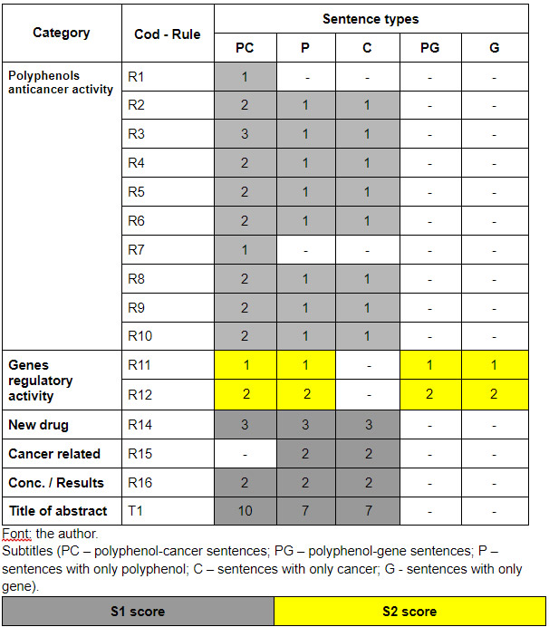

<h1>System for the retrieval and ranking of indexed information</h1>

This repository contains files and information about the <strong> step 4 of Kaphta Architecture: System for the retrieval and ranking of indexed information</strong>. In this stage are presented 5 algorithms for 5 search types: search for polyphenol, search for cancer, search for gene, search for polyphenol-cancer, e search for polyphenol-gene. According to the type of search performed, the system retrieves indexed abstracts in past stage (<a href='https://github.com/ramongsilva/Indexing-of-extracted-information'>Indexing of Extracted Information step</a>) and submits them to the ranking algorithm that returns five scores (S1, S2, S3, S4, and S5) for each abstract. In the algorithm, the calculation of S1, S2 and S3 varies according to the type of search. Scores S1 and S2 are calculated considering the number and type of sentence (PC – polyphenol-cancer sentences; PG – polyphenol-gene sentences; P – only polyphenol sentences; C – only cancer sentences; G – only gene sentences) containing recognized entities and rules. The points assigned are different for the different types of sentences (PC, PG, P, C, and G). 

  See below Table of points and Algorithm for ranking indexed PubMed abstracts.

  

    <h2>Table of points for S1 and S2 scores calculation on the  retrieval and ranking algorithm</h2>
    
    <h2>Description of algorithm for ranking indexed PubMed abstracts </h2>    
    
The algorithm performs the retrieval and ranking of indexed articles based on the user's search type: search for polyphenol, search for cancer, search for gene, search for polyphenol-cancer, or search for polyphenol-gene. From there, the execution continues:

    
<strong>Search for polyphenol</strong>

    <i><ul>
     <li>Input: id of the Polyphenol (P) searched;
     <li>Retrieval of indexed PubMed abstracts related to the P searched, on df_polyphenol_individual_indexation.tsv file;</li>
     <li>Loop start: for each PubMed abstract are calculated the scores:
       <ul>
         <li>S1 = s1_score_calc_PC() +  s1_score_calc_P(); <strong>// where P refers to the polyphenol entity searched, and C can be anything cancer entity</strong></li>
         <li>S2 = s2_score_calc();  <strong>// where P refers to the polyphenol entity searched, and C and G can be anything cancer and gene entities </strong></li>
         <li>S3 = sum of P entities recognized in PubMed abstract;</li>
       </ul>       
     </li>
     <li>Loop end</li>
    </ul></i>    
    
<strong>Search for Cancer</strong>

    <i><ul>
     <li>Input: id of the Cancer (C) searched;
     <li>Retrieval of indexed PubMed abstracts related to the C searched, on df_cancers_individual_indexation.tsv file;</li>
     <li>Loop start: for each PubMed abstract are calculated the scores:
       <ul>
         <li>S1 = s1_score_calc_PC() +  s1_score_calc_P(); <strong>// where C refers to the cancer entity searched, and P can be anything polyphenol entity</strong></li>
         <li>S2 = s2_score_calc();  <strong>// where C refers to the cancer entity searched, and P and G can be anything polyphenol and gene entities </strong></li>
         <li>S3 = sum of C entities recognized in PubMed abstract;</li>
       </ul>       
     </li>
     <li>Loop end</li>
    </ul></i>
     
<strong>Search for Gene</strong>

    <i><ul>
     <li>Input: id of the Gene (G) searched;
     <li>Retrieval of indexed PubMed abstracts related to the G searched, on df_genes_individual_indexation.tsv file;</li>
     <li>Loop start: for each PubMed abstract are calculated the scores:
       <ul>
         <li>S1 = s1_score_calc_PC() +  s1_score_calc_P(); <strong>// where P and C can be anything polyphenol and cancer entity searched
</strong></li>
         <li>S2 = s2_score_calc();  <strong>// where P and C can be anything polyphenol and cancer entity searched, and G refers to the entity gene searched 
</strong></li>
         <li>S3 = sum of G entities recognized in PubMed abstract;</li>
       </ul>       
     </li>
     <li>Loop end</li>
    </ul></i>
      
<strong>Search for polyphenol-cancer</strong>

    <i><ul>
      <li>Input: Ids of the Polyphenol (P) and Cancer (C) searched;</li>
     <li>Retrieval of indexed PubMed abstracts related to the P and C searched, on df_cross_indexation_polyphenol_cancer_association.tsv file;</li>
     <li>Loop start: for each PubMed abstract are calculated the scores:
       <ul>
         <li>S1 = s1_score_calc_PC() +  s1_score_calc_P(); <strong>// where P e C refers to the searched entities</strong></li>
         <li>S2 = s2_score_calc();  <strong>// where P and C refers to the searched entities, and G can be anything gene entity</strong></li>
         <li>S3 = sum of P and C entities recognized in PubMed abstract;</li>
       </ul>       
     </li>
     <li>Loop end</li>
    </ul></i>
    
<strong>Search for polyphenol-gene</strong>

    <i><ul>
     <li>Input: Ids of the Polyphenol (P) and Gene (G) searched</li>
     <li>Retrieval of indexed PubMed abstracts related to the P and G searched, on df_cross_indexation_gene_polyphenol_association.tsv file;</li>
     <li>Loop start: for each PubMed abstract are calculated the scores:
       <ul>
         <li>S1 = s1_score_calc_PC() +  s1_score_calc_P(); <strong>// where P refers to the searched polyphenol entity, and C can be anything cancer entity</strong></li>
         <li>S2 = s2_score_calc();  <strong>// where P e G refers to the searched entities, and C can be anything cancer entity</strong></li>
         <li>S3 = sum of P and G entities recognized in PubMed abstract;</li>
       </ul>       
     </li>
     <li>Loop end</li>
    </ul></i>
    
<strong>//Final processing, after loop</strong>

    Normalization of S1, S2 and S3 scores (0 to 1);
S4 → (5*S1 + 2*S2 + 3*S3) / 10;
 S5 → result of text classification based on ensemble;
    <strong>Result (output) → list of the PubMed abstracts with extracted information and ranking scores calculated</strong>.

    
